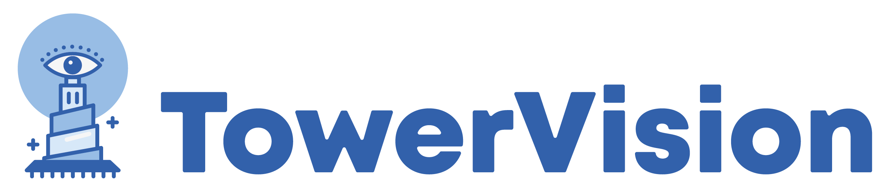

# 🏗️ TowerVision.io

<div align="center">



**Understanding and Improving Multilinguality in Vision-Language Models**

[](https://GuilhermeViveiros.github.io/TowerVision.io)
[](https://reactjs.org/)
[](./LICENSE)

*A comprehensive research website showcasing TowerVision, a fully open multilingual multimodal language model designed to bridge multilingual and multicultural gaps in visual understanding tasks.*

</div>

---

## 🌟 Overview

TowerVision.io is the official research website for **TowerVision**, a groundbreaking multilingual multimodal language model (MLLM) that addresses the critical gap in cross-lingual visual understanding. This interactive website presents our research findings, model architecture, training methodology, and comprehensive evaluation results.

### 🎯 Key Features

- **📊 Interactive Results Dashboard**: Comprehensive performance tables across multiple benchmarks
- **🏗️ Model Architecture Visualization**: Detailed breakdown of TowerVision's three-stage training process  
- **📈 VisionBlocks Dataset**: Complete overview of our 6M multilingual multimodal dataset
- **🔬 Ablation Studies**: In-depth analysis of design choices and training strategies
- **🌍 Cultural Examples Carousel**: Live demonstration of multilingual capabilities
- **📱 Responsive Design**: Optimized for desktop, tablet, and mobile viewing

---

## 🚀 Live Demo

Visit the live website: **[TowerVision.io](https://GuilhermeViveiros.github.io/TowerVision.io)**

### 🎮 Interactive Features

- **Dynamic Cultural Examples**: Rotating carousel showcasing TowerVision's multilingual understanding
- **Performance Tables**: Sortable and filterable benchmark results
- **Smooth Navigation**: Seamless scrolling between research sections
- **Clickable Author Profiles**: Direct links to researcher websites
- **Institution Affiliations**: Clear mapping of authors to institutions

---

## 🏛️ Research Overview

### 📋 Abstract

TowerVision introduces a fully open multilingual multimodal language model designed to bridge multilingual and multicultural gaps in visual understanding tasks. Trained on **VisionBlocks**, our diverse multilingual multimodal instruction tuning dataset spanning **20 languages** with cultural awareness and cross-lingual capabilities.

### 🎯 Key Contributions

1. **🤖 TowerVision Models**: 2B and 9B parameter multilingual multimodal models
2. **📚 VisionBlocks Dataset**: 6M multilingual samples across diverse visual tasks  
3. **🔬 Comprehensive Evaluation**: Performance analysis across multiple benchmarks
4. **🌐 Cultural Awareness**: Focus on cross-cultural understanding and representation

---

## 🛠️ Technical Stack

### Frontend Technologies

- **⚛️ React 18.2.0** - Modern UI framework
- **🎨 CSS3** - Custom styling with advanced animations
- **📱 Responsive Design** - Mobile-first approach
- **🔤 Google Fonts** - Piazzolla and Libre Baskerville typography
- **🎯 Modern JavaScript** - ES6+ features and hooks

### 📦 Dependencies

```json
{
  "react": "^18.2.0",
  "react-dom": "^18.2.0",
  "react-router-dom": "^6.8.1",
  "@heroicons/react": "^2.0.16",
  "lucide-react": "^0.544.0"
}
```

### 🏗️ Project Structure

```
TowerVision.io/
├── 📁 public/
│   ├── 🖼️ cultural_examples/     # Cultural understanding examples
│   ├── 🏛️ institution_logos/    # University and company logos
│   ├── 📊 data.json             # Cultural examples data
│   └── 🗼 Tower.png             # TowerVision logo
├── 📁 src/
│   ├── 📁 components/
│   │   ├── 📄 Abstract.js        # Hero section with authors
│   │   ├── 📊 ResultsSection.js  # Performance benchmarks
│   │   ├── 🏗️ ModelStructureSection.js  # Architecture details
│   │   ├── 📚 DataSection.js     # VisionBlocks dataset
│   │   └── 🔬 AblationSection.js # Ablation studies
│   ├── 🎨 App.css               # Global styles
│   └── ⚛️ App.js                # Main application component
└── 📋 package.json              # Project configuration
```

---

## 🚀 Getting Started

### 📋 Prerequisites

- **Node.js** (v16 or higher)
- **npm** or **yarn**

### 🔧 Installation

1. **Clone the repository**
   ```bash
   git clone https://github.com/GuilhermeViveiros/TowerVision.io.git
   cd TowerVision.io
   ```

2. **Install dependencies**
   ```bash
   npm install
   ```

3. **Start development server**
   ```bash
   npm start
   ```

4. **Open in browser**
   ```
   http://localhost:3000
   ```

### 🏗️ Build for Production

```bash
npm run build
```

### 🚀 Deploy to GitHub Pages

```bash
npm run deploy
```

---

## 👥 Research Team

### 🎓 Authors & Affiliations

| Author | Institutions | Profile |
|--------|-------------|---------|
| **Andre G. Viveiros** ⭐ | IT¹, IST² | [🔗 Website](https://www.gviveiros.com/) |
| **Patrick Fernandes** | IT¹, IST², CMU⁴ | [🔗 Website](https://patricksf.dev/) |
| **Saul Santos** | IT¹, IST² | [🔗 Website](https://ssantos97.github.io/) |
| **Sonal Sannigrahi** | IT¹, IST² | [🔗 Website](https://sonalsannigrahi.github.io/) |
| **Emmanouil Zaranis** | IT¹, IST² | [🔗 Website](https://manzar96.github.io/) |
| **Nuno M Guerreiro** | Unbabel³ | [🔗 Website](https://nunonmg.github.io/) |
| **Amin Farajian** | Unbabel³ | [🔗 Profile](https://scholar.google.com/citations?user=b3LCxaYAAAAJ&hl=en) |
| **Graham Neubig** | CMU⁴ | [🔗 Website](https://www.phontron.com/) |
| **Andre Martins** | IT¹, IST², Unbabel³ | [🔗 Website](https://andre-martins.github.io/) |

### 🏛️ Institutions

1. **IT** - Instituto de Telecomunicações
2. **IST** - Instituto Superior Técnico  
3. **Unbabel** - Unbabel
4. **CMU** - Carnegie Mellon University

⭐ *Corresponding Author*

---

## 📊 Performance Highlights

### 🎯 VLMs Performance on Several Benchmarks

| Model | TextVQA | OCRBench | CC-OCR | ALM-Bench (en) | ALM-Bench (multi) |
|-------|---------|----------|--------|----------------|-------------------|
| **TowerVision-9B** | **73.6** | **69.7** | **56.3** | **83.6** | **85.2** |
| **TowerVision-2B** | 68.1 | 58.6 | 46.1 | 77.1 | **81.1** |
| Qwen2.5-VL-7B | 82.5 | **84.5** | **78.6** | 83.1 | 83.6 |

### 🌐 Multimodal Translation Benchmarks

| Model | Multi30K (en→cs) | Multi30K (en→de) | Multi30K (en→fr) | CoMMuTE Avg |
|-------|------------------|------------------|------------------|-------------|
| **TowerVision-9B** | **95.1** | **98.1** | **95.6** | **76.0** |
| **TowerVision-2B** | 90.3 | 97.5 | 94.7 | 73.5 |
| Qwen2.5-VL-7B | 83.9 | 97.1 | 93.2 | 77.8 |

---

## 🎨 Design Features

### 🌈 Visual Design

- **🎨 Modern Typography**: Piazzolla and Libre Baskerville fonts
- **🎯 Professional Color Scheme**: TowerVision blue (#2d5a87) with neutral grays
- **📱 Responsive Layout**: Mobile-first design with smooth breakpoints
- **✨ Smooth Animations**: CSS transitions and hover effects
- **🖼️ Interactive Elements**: Clickable authors, hoverable tables, animated carousel

### 🔧 Technical Features

- **⚡ Fast Loading**: Optimized images and efficient React components
- **♿ Accessibility**: Proper ARIA labels and semantic HTML
- **🔍 SEO Optimized**: Meta tags and structured data
- **📊 Interactive Tables**: Sortable performance benchmarks
- **🎮 Cultural Carousel**: Auto-rotating examples with manual controls

---

## 📈 Dataset Statistics

### 📊 VisionBlocks Dataset

- **📈 Total Samples**: 6M multilingual multimodal samples
- **🌍 Languages**: 20 languages with cultural awareness
- **📊 Multilingual Coverage**: 37% multilingual content
- **🎯 Created Data**: 20% newly generated synthetic data
- **🔄 Translation Quality**: CometKiwi threshold 0.85
- **🎥 Video Support**: LLaVA-Video-178k with multilingual translation

---

## 🤝 Contributing

We welcome contributions to improve the TowerVision website! Here's how you can help:

### 🐛 Bug Reports

1. Check existing issues
2. Create detailed bug report
3. Include browser/device information

### ✨ Feature Requests

1. Describe the feature
2. Explain the use case
3. Provide mockups if possible

### 🔧 Development

1. Fork the repository
2. Create feature branch
3. Make changes with tests
4. Submit pull request

---

## 📄 License

This project is licensed under the **MIT License** - see the [LICENSE](./LICENSE) file for details.

---

## 📞 Contact

### 📧 Corresponding Authors

**Andre G. Viveiros & Andre Martins**  
📧 Email: [andre.viveiros@tecnico.ulisboa.pt](mailto:andre.viveiros@tecnico.ulisboa.pt?subject=Question%20regarding%20TowerVision&body=Hey,%20I%20have%20a%20question%20regarding%20TowerVision%20...)

### 🔗 Links

- **🌐 Website**: [TowerVision.io](https://GuilhermeViveiros.github.io/TowerVision.io)
- **📄 Paper**: Coming soon on arXiv
- **💻 Code**: Repository links coming soon
- **🤗 Models**: Hugging Face checkpoints coming soon
- **📊 Dataset**: VisionBlocks dataset coming soon

---

## 🙏 Acknowledgments

Special thanks to:

- **🏛️ Instituto de Telecomunicações** for research support
- **🎓 Instituto Superior Técnico** for academic collaboration  
- **🚀 Unbabel** for industry partnership
- **🏫 Carnegie Mellon University** for international collaboration
- **🌍 Open Source Community** for tools and inspiration

---

<div align="center">

**Built with ❤️ by the TowerVision Research Team**

[](https://GuilhermeViveiros.github.io/TowerVision.io)

*Bridging languages, cultures, and visual understanding* 🌍👁️🗣️

</div>
